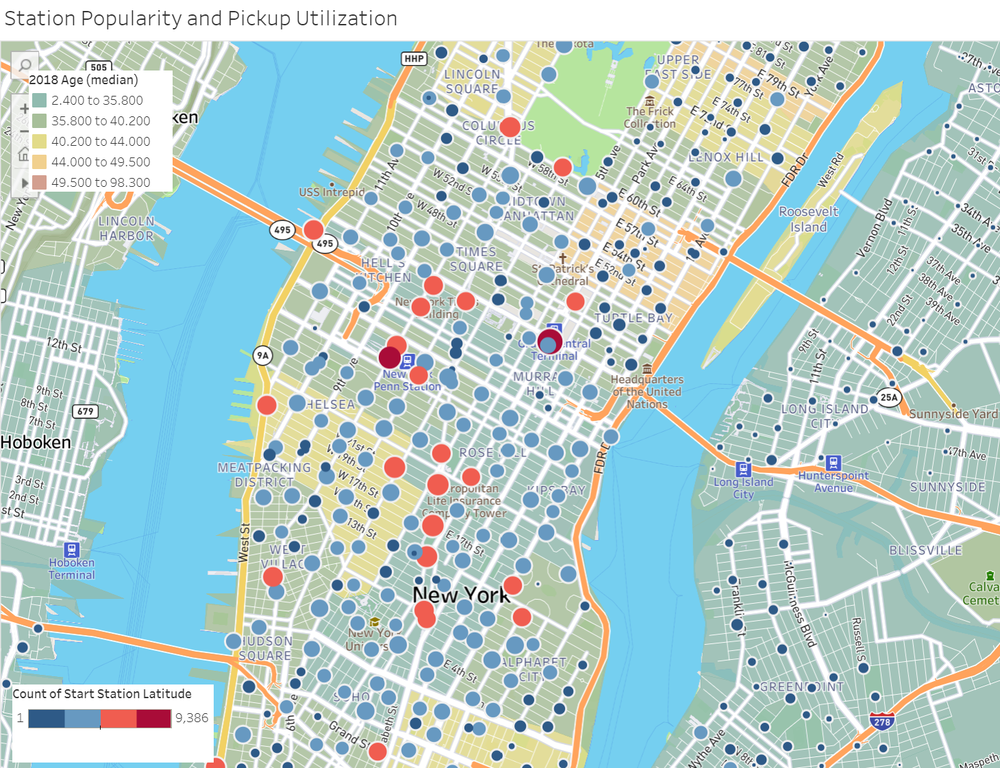

# Tableau-Highlights
Here is a description of the tableau visualizations I used to digest NYC bike-rider data. NYC operates stations where one can rent a bike to get around the city. The data of every bike ride is published by the city.

